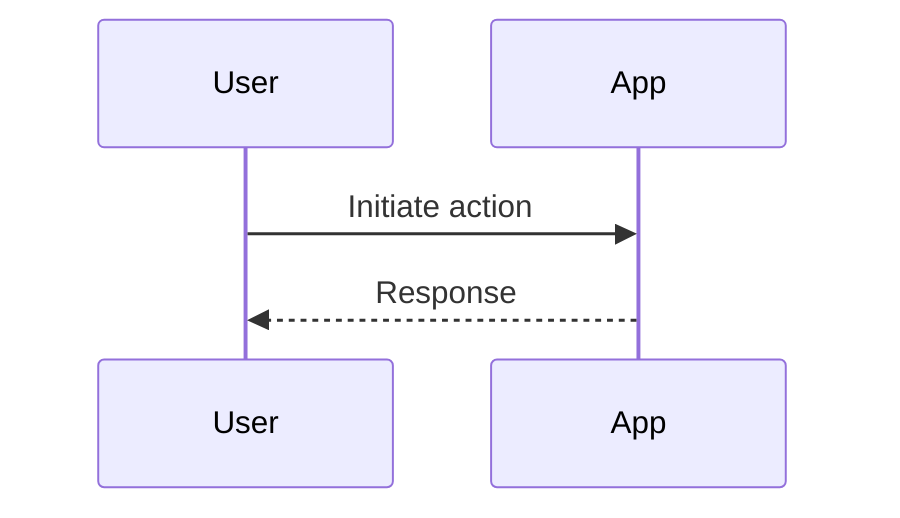

# App Flows Documentation Guide - Version 1.0.0

This file contains instructions and examples for documenting application flows in the [NOME_PROJETO] project. Complete flow documentation is organized in individual files within the `docs/app-flows/` folder.

## Flow Documentation Instructions

### File Organization

- **Location**: All flow documentation files must be in the `docs/app-flows/` folder
- **Naming**: Use descriptive names that reflect the flow (e.g., `main-flow.md`, `auth-flow.md`)
- **Multiple Flows**: A single file documents one specific flow
- **Size Limit**: Each file must not exceed **250 lines** to maintain readability
- **Grouping**: Group flows by functionality or domain (e.g., authentication, payment)

### Required Structure for Each Flow

Each documented flow must contain:

1. **Title**: `# [FLOW_NAME] Flow`
2. **Purpose & Scope**: Clear description of the flow's objective
3. **Implementation Guidelines**: Step-by-step guidelines
4. **Mermaid Diagram**: Visual representation using Mermaid syntax
5. **Notes**: Additional important information or adaptations

## Flow Documentation Example

### Main App Flow

**Purpose & Scope:** This flow outlines the primary user journey in the application.

**Implementation Guidelines:**

1. User initiates the main action.
2. App validates input.
3. Processing and integration.
4. Returns result.

**Mermaid Diagram:**

**Notes:** Adapt this to specific project needs.