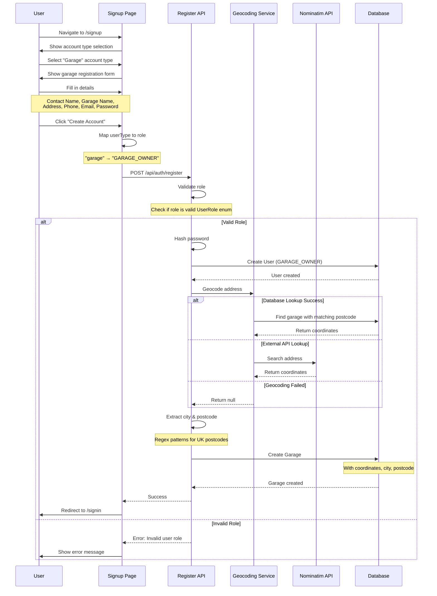

# Garage Registration Flow

## Purpose & Scope

This document describes the garage registration flow in the BookaMOT application, including user role mapping, automatic geocoding, address parsing, and schedule creation. This flow is specifically for garage owners creating business accounts.

---

## Implementation Guidelines

### Overview

Garage registration is a specialized signup flow that:
1. Creates a user account with `GARAGE_OWNER` role
2. Automatically geocodes the garage address
3. Extracts city and postcode from the address
4. Creates a garage record with coordinates
5. Sets up default operating schedules

### Key Components

- **Signup Page** (`src/app/signup/page.tsx`) - User registration form
- **Register API** (`src/app/api/auth/register/route.ts`) - Backend validation and creation
- **Geocoding Service** (`src/lib/geocoding.ts`) - Address to coordinates conversion (see `geocoding-service.md`)
- **Database** - User, Garage, and GarageSchedule models

### Geocoding Integration

The garage registration flow uses the **geocoding service** to automatically convert addresses into coordinates. This enables:
- Distance-based garage search
- Accurate location mapping
- Automatic postcode/city extraction

**Geocoding Strategies (in order):**
1. **Database Exact Match** - Fastest, uses existing garage coordinates
2. **Database Area Match** - Uses nearby garage coordinates
3. **External API (Nominatim)** - Fallback for new locations

For detailed information about the geocoding system, see `../geocoding-service.md`.

---

## User Flow Diagram



---

## Detailed Flow Steps

### Step 1: Account Type Selection

**Location:** Signup Page (`/signup`)

**User Action:**
1. Navigate to signup page
2. Choose between "Customer" or "Garage" account type

**UI:**
```tsx
<div className="grid grid-cols-2 gap-4">
  <Button
    type="button"
    variant={userType === 'customer' ? 'default' : 'outline'}
    onClick={() => setUserType('customer')}
  >
    Customer
  </Button>
  <Button
    type="button"
    variant={userType === 'garage' ? 'default' : 'outline'}
    onClick={() => setUserType('garage')}
  >
    Garage
  </Button>
</div>
```

---

### Step 2: Garage Form Fields

**Required Fields (Garage Account):**

| Field | Type | Validation | Example |
|-------|------|------------|---------|
| Contact Name | Text | Required | "Jane Smith" |
| Garage Name | Text | Required | "Smith's Auto Service" |
| Address | Text | Required | "123 High Street, Stevenage, SG1 1AA" |
| Phone | Text | Required, UK format | "01438 123456" |
| Email | Email | Required, unique | "jane@smithauto.com" |
| Password | Password | Min 6 chars | "password123" |
| Confirm Password | Password | Must match | "password123" |

**Form State:**
```typescript
const [formData, setFormData] = useState({
  name: '',           // Contact name
  garageName: '',     // Business name
  address: '',        // Full address
  phone: '',          // Contact phone
  email: '',          // Business email
  password: '',
  confirmPassword: '',
  userType: 'garage'
})
```

---

### Step 3: Role Mapping

**Critical:** Map UI `userType` to correct Prisma `UserRole` enum

**Before (Incorrect):**
```typescript
role: formData.userType.toUpperCase()  // ❌ "GARAGE" is invalid
```

**After (Correct):**
```typescript
role: formData.userType === 'garage' ? 'GARAGE_OWNER' : 'CUSTOMER'  // ✅
```

**UserRole Enum:**
```prisma
enum UserRole {
  CUSTOMER
  GARAGE_OWNER  // ✅ Correct value for garages
  ADMIN
}
```

**Why This Matters:**
- API validates role against enum values
- `"GARAGE"` is NOT a valid enum value
- Must use `"GARAGE_OWNER"` exactly

---

### Step 4: API Validation

**Endpoint:** `POST /api/auth/register`

**Request Body:**
```json
{
  "name": "Jane Smith",
  "email": "jane@smithauto.com",
  "password": "password123",
  "role": "GARAGE_OWNER",
  "garageName": "Smith's Auto Service",
  "address": "123 High Street, Stevenage, SG1 1AA",
  "phone": "01438 123456"
}
```

**Validation Steps:**

```typescript
// 1. Check required fields
if (!name || !email || !password || !role) {
  return NextResponse.json(
    { error: 'Missing required fields' },
    { status: 400 }
  )
}

// 2. Validate role
if (!Object.values(UserRole).includes(role)) {
  return NextResponse.json(
    { error: 'Invalid user role' },
    { status: 400 }
  )
}

// 3. Check email uniqueness
const existingUser = await prisma.user.findUnique({
  where: { email }
})

if (existingUser) {
  return NextResponse.json(
    { error: 'User with this email already exists' },
    { status: 400 }
  )
}

// 4. Validate garage-specific fields
if (role === UserRole.GARAGE_OWNER) {
  if (!garageName || !address || !phone) {
    return NextResponse.json(
      { error: 'Garage name, address, and phone are required for garage accounts' },
      { status: 400 }
    )
  }
}
```

---

### Step 5: User Creation

**Create User Account:**

```typescript
const hashedPassword = await bcrypt.hash(password, 10)

const user = await prisma.user.create({
  data: {
    name,
    email,
    password: hashedPassword,
    role: UserRole.GARAGE_OWNER
  }
})
```

---

### Step 6: Address Geocoding

**Purpose:** Convert address to latitude/longitude coordinates

**Service:** `geocodeAddress()` from `src/lib/geocoding.ts`

**Strategy (3-tier):**

1. **Database Exact Match**
   ```typescript
   // Look for garage with exact postcode
   const garage = await prisma.garage.findFirst({
     where: {
       postcode: { equals: 'SG1 1AA', mode: 'insensitive' },
       latitude: { not: null },
       longitude: { not: null }
     }
   })
   ```

2. **Database Area Match**
   ```typescript
   // Look for garage in same area (first 3 chars)
   const areaGarage = await prisma.garage.findFirst({
     where: {
       postcode: { startsWith: 'SG1', mode: 'insensitive' },
       latitude: { not: null },
       longitude: { not: null }
     }
   })
   ```

3. **External API (Nominatim)**
   ```typescript
   const url = `https://nominatim.openstreetmap.org/search?q=${address}, UK&format=json&limit=1&countrycodes=gb`
   const response = await fetch(url, {
     headers: { 'User-Agent': 'BookAMOT-SaaS/1.0' }
   })
   ```

**Result:**
```typescript
{
  lat: 51.9025,
  lng: -0.2021
}
// or null if geocoding fails
```

---

### Step 7: Address Parsing

**Extract City and Postcode:**

```typescript
const addressParts = address.split(',').map(part => part.trim())
let city = 'Unknown'
let postcode = 'N/A'

// Extract postcode (UK format)
const postcodeRegex = /\b[A-Z]{1,2}[0-9][A-Z0-9]?\s?[0-9][A-Z]{2}\b/i
const postcodeMatch = address.match(postcodeRegex)

if (postcodeMatch) {
  postcode = postcodeMatch[0].toUpperCase()
}

// Extract city (second-to-last part if postcode found)
if (addressParts.length >= 2) {
  const cityPart = addressParts[addressParts.length - (postcodeMatch ? 2 : 1)]
  if (cityPart && !postcodeRegex.test(cityPart)) {
    city = cityPart
  }
}
```

**Examples:**

| Address | Extracted City | Extracted Postcode |
|---------|----------------|-------------------|
| "123 High Street, Stevenage, SG1 1AA" | "Stevenage" | "SG1 1AA" |
| "45 Main Road, London, SW1A 1AA" | "London" | "SW1A 1AA" |
| "78 Park Lane, Manchester" | "Manchester" | "N/A" |

---

### Step 8: Garage Creation

**Create Garage Record:**

```typescript
const garage = await prisma.garage.create({
  data: {
    name: garageName,
    address,
    city,
    postcode,
    latitude: coords?.lat,      // Can be null
    longitude: coords?.lng,     // Can be null
    phone,
    email,
    ownerId: user.id,
    motLicenseNumber: `MOT-${Date.now()}`,
    dvlaApproved: false,
    motPrice: 54.85,            // Default MOT price
    reviewCount: 0,
    rating: 0
  }
})
```

**Key Points:**
- `latitude` and `longitude` are optional (can be null)
- `motLicenseNumber` is auto-generated
- `dvlaApproved` defaults to false (requires admin approval)
- Default MOT price: £54.85 (UK standard)

---

### Step 9: Success Response

**API Response:**

```json
{
  "message": "User and garage registered successfully",
  "user": {
    "id": "clx123...",
    "name": "Jane Smith",
    "email": "jane@smithauto.com",
    "role": "GARAGE_OWNER"
  },
  "garage": {
    "id": "clx456...",
    "name": "Smith's Auto Service",
    "address": "123 High Street, Stevenage, SG1 1AA",
    "city": "Stevenage",
    "postcode": "SG1 1AA",
    "latitude": 51.9025,
    "longitude": -0.2021
  }
}
```

**Redirect:**
```typescript
router.push('/signin?message=Registration successful. Please sign in.')
```

---

## Error Handling

### Invalid Role Error

**Cause:** Sending `role: "GARAGE"` instead of `role: "GARAGE_OWNER"`

**Response:**
```json
{
  "error": "Invalid user role"
}
```

**Fix:** Ensure proper role mapping in signup form

### Missing Garage Fields

**Cause:** Garage-specific fields not provided

**Response:**
```json
{
  "error": "Garage name, address, and phone are required for garage accounts"
}
```

**Action:** User must fill in all required fields

### Duplicate Email

**Cause:** Email already registered

**Response:**
```json
{
  "error": "User with this email already exists"
}
```

**Action:** User must use different email or sign in

### Geocoding Failure

**Cause:** Address cannot be geocoded

**Action:** Garage created with `null` coordinates

**Impact:**
- Garage still functional
- Won't appear in distance-based searches
- Can be updated later with correct coordinates

---

## Database Schema

### User Model
```prisma
model User {
  id       String   @id @default(cuid())
  name     String
  email    String   @unique
  password String
  role     UserRole @default(CUSTOMER)
  garages  Garage[]
}
```

### Garage Model
```prisma
model Garage {
  id                String   @id @default(cuid())
  name              String
  address           String
  city              String
  postcode          String
  latitude          Float?
  longitude         Float?
  phone             String
  email             String
  ownerId           String
  owner             User     @relation(fields: [ownerId], references: [id])
  motLicenseNumber  String
  dvlaApproved      Boolean  @default(false)
  motPrice          Float    @default(54.85)
  rating            Float    @default(0)
  reviewCount       Int      @default(0)
}
```

---

## Testing Scenarios

### Scenario 1: Successful Registration
1. Select "Garage" account type
2. Fill in all required fields
3. Click "Create Account"
4. **Expected:** User and garage created, redirect to signin

### Scenario 2: Invalid Role Mapping
1. Code sends `role: "GARAGE"`
2. **Expected:** Error "Invalid user role"
3. **Fix:** Update role mapping to "GARAGE_OWNER"

### Scenario 3: Missing Fields
1. Leave garage name empty
2. Click "Create Account"
3. **Expected:** Error "Garage name, address, and phone are required"

### Scenario 4: Geocoding Success
1. Enter address "123 High Street, Stevenage, SG1 1AA"
2. **Expected:** Coordinates (51.9025, -0.2021) saved

### Scenario 5: Geocoding Failure
1. Enter invalid address "INVALID ADDRESS"
2. **Expected:** Garage created with null coordinates

---

## Related Documentation

- `booking-flow.md` - Complete booking process
- `onboarding-flow.md` - New user onboarding
- `vehicle-registration-flow.md` - Vehicle registration details
- `GEOCODING_SYSTEM.md` - Geocoding service documentation

