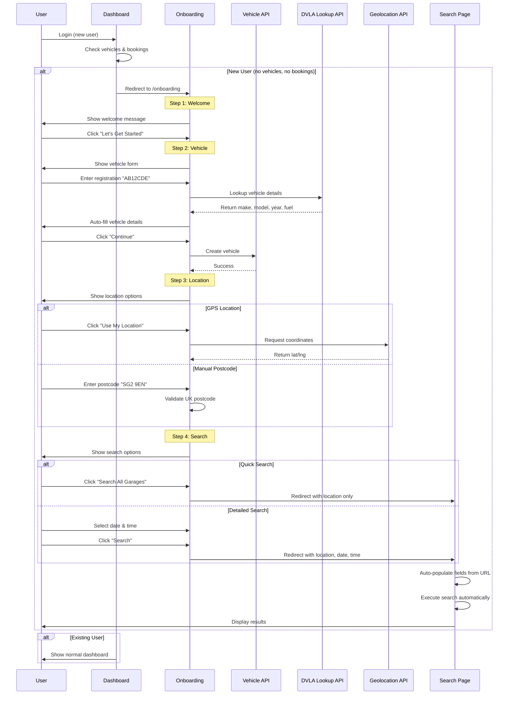

# Onboarding Flow

## Purpose & Scope

This document describes the complete onboarding flow for new users in the BookaMOT application. The flow guides users through vehicle registration, location selection, and their first MOT search in a friendly, conversational manner.

**Goal:** Reduce friction and increase conversion for new users by providing a guided, step-by-step experience.

---

## Implementation Guidelines

### Overview

The onboarding flow consists of four main steps:
1. **Welcome** - Introduction and overview
2. **Vehicle Registration** - Add first vehicle with auto-lookup
3. **Location Selection** - GPS or postcode entry
4. **Search Preferences** - Quick or detailed MOT search

### Key Components

- **Onboarding Page** (`src/app/onboarding/page.tsx`) - Main orchestrator
- **Progress Indicator** (`src/components/onboarding/progress-indicator.tsx`) - Visual progress tracking
- **Welcome Step** (`src/components/onboarding/welcome-step.tsx`) - Step 1
- **Vehicle Step** (`src/components/onboarding/vehicle-step.tsx`) - Step 2
- **Location Step** (`src/components/onboarding/location-step.tsx`) - Step 3
- **Search Step** (`src/components/onboarding/search-step.tsx`) - Step 4
- **Dashboard** (`src/app/dashboard/page.tsx`) - Triggers onboarding for new users

---

## User Flow Diagram



---

## Detailed Flow Steps

### Trigger: Dashboard Check

**Location:** Dashboard (`/dashboard`)

**Condition:**
```typescript
const hasNoVehicles = vehicles.length === 0
const hasNoBookings = bookings.length === 0

if (hasNoVehicles && hasNoBookings) {
  router.push('/onboarding')
}
```

**Logic:**
- New users (no vehicles AND no bookings) → Redirect to onboarding
- Existing users → Show normal dashboard

---

### Step 1: Welcome

**Component:** `welcome-step.tsx`

**Purpose:** Introduce the onboarding process and set expectations

**Content:**
- Personalized greeting with user's name
- Overview of the 3-step process (Vehicle → Location → Search)
- Time estimate: "2-3 minutes"
- Visual preview of each step with icons
- Two action buttons:
  - **Primary:** "Let's Get Started" → Continue to Step 2
  - **Secondary:** "I'll do this later" → Skip to dashboard

**Design Principles:**
- Conversational tone
- Clear value proposition
- Low commitment (can skip)
- Visual progress indication

---

### Step 2: Vehicle Registration

**Component:** `vehicle-step.tsx`

**Purpose:** Add user's first vehicle with minimal friction

**Features:**

1. **Auto-Lookup from DVLA**
   - User enters registration number (e.g., "AB12CDE")
   - System calls `/api/vehicles/lookup?registration=AB12CDE`
   - Auto-fills: make, model, year, fuel type, color, engine size
   - Reduces manual entry and errors

2. **Manual Entry Fallback**
   - If lookup fails, show manual entry fields
   - User can fill in details manually
   - All fields validated before submission

3. **Real-time Validation**
   - Registration format validation
   - Required field checks
   - Visual feedback (loading, success, error states)

**API Integration:**

```typescript
// Lookup vehicle
GET /api/vehicles/lookup?registration={reg}

Response:
{
  "make": "Ford",
  "model": "Focus",
  "year": 2020,
  "fuelType": "PETROL",
  "color": "Blue",
  "engineSize": "1.6"
}

// Create vehicle
POST /api/vehicles
Body: {
  "registration": "AB12CDE",
  "make": "Ford",
  "model": "Focus",
  "year": 2020,
  "fuelType": "PETROL"
}
```

**Navigation:**
- **Back:** Return to Step 1
- **Continue:** Save vehicle and proceed to Step 3

---

### Step 3: Location Selection

**Component:** `location-step.tsx`

**Purpose:** Determine user's location for garage search

**Options:**

1. **Option 1: Use GPS Location (Recommended)**
   - Click "Use My Location" button
   - Browser requests geolocation permission
   - System captures latitude/longitude
   - Fastest and most accurate method

   ```typescript
   navigator.geolocation.getCurrentPosition(
     (position) => {
       const location = {
         lat: position.coords.latitude,
         lng: position.coords.longitude
       }
       onNext(location)
     },
     (error) => {
       // Show error, fall back to postcode
     }
   )
   ```

2. **Option 2: Enter Postcode Manually**
   - Input field for UK postcode
   - Real-time validation (format: "SW1A 1AA")
   - Privacy-friendly alternative to GPS

**Validation:**
- UK postcode format: `^[A-Z]{1,2}[0-9][A-Z0-9]? ?[0-9][A-Z]{2}$`
- Case-insensitive
- Spaces optional

**Error Handling:**
- GPS denied → Show postcode input
- Invalid postcode → Show error message
- Network error → Allow retry

**Navigation:**
- **Back:** Return to Step 2 (vehicle data preserved)
- **Continue:** Proceed to Step 4 with location data

---

### Step 4: Search Preferences

**Component:** `search-step.tsx`

**Purpose:** Configure MOT search parameters

**Options:**

1. **Quick Search**
   - Click "Search All Garages"
   - Shows all available slots for selected location
   - No date/time filtering
   - Fastest path to results

2. **Detailed Search**
   - Select specific date (future dates only)
   - Select preferred time slot (09:00-17:00)
   - More targeted results
   - Better for users with specific requirements

**Date Picker:**
- Only future dates selectable
- Default: Today's date
- Format: YYYY-MM-DD

**Time Slots:**
```typescript
const timeSlots = [
  '09:00', '09:30', '10:00', '10:30', '11:00', '11:30',
  '12:00', '12:30', '13:00', '13:30', '14:00', '14:30',
  '15:00', '15:30', '16:00', '16:30', '17:00'
]
```

**Redirect Logic:**

```typescript
// Quick Search
router.push(`/search?location=${postcode}`)

// Detailed Search
const params = new URLSearchParams({
  location: postcode,
  date: format(date, 'yyyy-MM-dd'),
  time: time
})
router.push(`/search?${params}`)
```

**Navigation:**
- **Back:** Return to Step 3 (location data preserved)
- **Search:** Redirect to search page with parameters

---

### Step 5: Auto-Search on Search Page

**Location:** Search Page (`/search`)

**Behavior:**
1. Page loads with URL parameters
2. `useEffect` reads parameters from URL
3. Auto-populates search form fields
4. Automatically executes search
5. Displays results immediately

**Implementation:**
```typescript
useEffect(() => {
  const location = searchParams.get('location')
  const date = searchParams.get('date')
  const time = searchParams.get('time')

  if (location) {
    setSearchLocation(location)
    setDebouncedSearchTerm(location) // Triggers search immediately
  }
  if (date) {
    setSelectedDate(date)
  }
}, [searchParams])
```

**Result:**
- Seamless transition from onboarding to search results
- No manual search required
- Context preserved from onboarding

---

## State Management

### Onboarding Page State

```typescript
const [currentStep, setCurrentStep] = useState(1)
const [vehicleData, setVehicleData] = useState(null)
const [locationData, setLocationData] = useState(null)
```

### Navigation Functions

```typescript
// Forward navigation
const handleNext = () => setCurrentStep(prev => prev + 1)

// Backward navigation
const handleBack = () => setCurrentStep(prev => prev - 1)

// With data
const handleVehicleNext = (vehicle) => {
  setVehicleData(vehicle)
  handleNext()
}

const handleLocationNext = (location) => {
  setLocationData(location)
  handleNext()
}
```

---

## Progress Tracking

**Component:** `progress-indicator.tsx`

**Features:**
- Shows current step (1/4, 2/4, 3/4, 4/4)
- Visual progress bar
- Step titles and descriptions
- Mobile: Simple progress bar
- Desktop: Detailed step indicator with icons

**Icons:**
- Step 1: Sparkles (✨)
- Step 2: Car (🚗)
- Step 3: MapPin (📍)
- Step 4: Search (🔍)

---

## Design Principles

### 1. Conversational Tone
```
❌ "Enter vehicle registration number"
✅ "Tell us about your vehicle"

❌ "Location required"
✅ "Great! Now let's find MOT centres near you"
```

### 2. Progressive Disclosure
- One task at a time
- No overwhelming forms
- Clear next steps
- Visual progress

### 3. Flexibility
- Multiple options at each step
- Skip option available
- Back navigation
- No forced path

### 4. Visual Feedback
- Loading states
- Success indicators
- Error messages
- Progress visualization

### 5. Mobile-First
- Responsive layouts
- Touch-friendly buttons
- Optimized inputs
- Simplified mobile UI

---

## Testing Checklist

### Functional Testing
- [ ] New user redirects to onboarding
- [ ] Existing user sees normal dashboard
- [ ] Welcome step displays correctly
- [ ] Vehicle auto-lookup works
- [ ] Manual vehicle entry works
- [ ] GPS location works
- [ ] Postcode entry works
- [ ] Quick search redirects correctly
- [ ] Detailed search with date/time works
- [ ] Back navigation preserves data
- [ ] Skip option works

### Edge Cases
- [ ] User denies GPS permission → Falls back to postcode
- [ ] Invalid registration number → Shows manual entry
- [ ] Invalid postcode format → Shows error
- [ ] API timeout → Shows error, allows retry
- [ ] Network error → Graceful degradation
- [ ] Browser refresh mid-flow → Loses progress (expected)

### Accessibility
- [ ] Keyboard navigation works
- [ ] Screen reader compatible
- [ ] ARIA labels present
- [ ] Focus indicators visible
- [ ] High contrast mode supported

---

## Related Documentation

- `booking-flow.md` - Complete booking process
- `vehicle-registration-flow.md` - Vehicle registration details
- `garage-registration-flow.md` - Garage account setup

