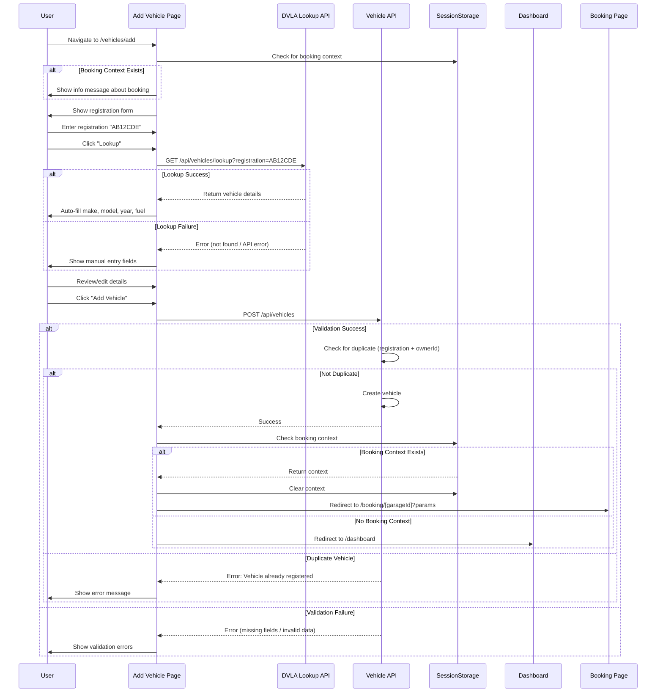

# Vehicle Registration Flow

## Purpose & Scope

This document describes the vehicle registration flow in the BookaMOT application, including both standalone registration and registration within the booking flow. It covers DVLA auto-lookup, validation, error handling, and context-aware redirects.

---

## Implementation Guidelines

### Overview

Vehicle registration can occur in two contexts:
1. **Standalone** - User adds vehicle from dashboard/vehicles page
2. **Booking Flow** - User adds vehicle during MOT booking process

The system handles both scenarios with appropriate redirects and context preservation.

### Key Components

- **Vehicle Add Page** (`src/app/vehicles/add/page.tsx`) - Main registration form
- **Vehicle API** (`src/app/api/vehicles/route.ts`) - Backend validation and creation
- **DVLA Lookup API** (`src/app/api/vehicles/lookup/route.ts`) - Auto-lookup service
- **Session Storage** - Preserves booking context during registration

---

## User Flow Diagram



---

## Detailed Flow Steps

### Step 1: Access Vehicle Registration

**Entry Points:**
1. **From Dashboard:** Click "Add Vehicle" button
2. **From Booking Flow:** Redirected when user has no vehicles
3. **From Onboarding:** Step 2 of onboarding process
4. **Direct URL:** Navigate to `/vehicles/add`

**Initial Check:**
```typescript
useEffect(() => {
  const contextStr = sessionStorage.getItem('bookingSearchContext')
  if (contextStr) {
    setIsBookingFlow(true)
    // Show info message
  }
}, [])
```

**Info Message (if booking context exists):**
```
"Booking in progress: After adding your vehicle, you'll be redirected to complete your MOT booking."
```

---

### Step 2: DVLA Auto-Lookup

**Purpose:** Automatically fetch vehicle details from DVLA database

**User Action:**
1. Enter registration number (e.g., "AB12CDE")
2. Click "Lookup" button

**API Call:**
```typescript
const lookupVehicle = async (registration: string) => {
  const response = await fetch(
    `/api/vehicles/lookup?registration=${registration}`
  )
  
  if (response.ok) {
    const data = await response.json()
    // Auto-fill form fields
    setFormData({
      registration: data.registration,
      make: data.make,
      model: data.model,
      year: data.year,
      fuelType: data.fuelType,
      color: data.color,
      engineSize: data.engineSize
    })
  } else {
    // Show manual entry fields
    setShowManualEntry(true)
  }
}
```

**Response (Success):**
```json
{
  "registration": "AB12CDE",
  "make": "Ford",
  "model": "Focus",
  "year": 2020,
  "fuelType": "PETROL",
  "color": "Blue",
  "engineSize": "1.6"
}
```

**Response (Failure):**
```json
{
  "error": "Vehicle not found in DVLA database"
}
```

**Fallback:**
- If lookup fails, show manual entry fields
- User can fill in all details manually
- No blocking - registration can proceed

---

### Step 3: Form Validation

**Client-Side Validation:**

```typescript
const validateForm = () => {
  const errors = []
  
  if (!formData.registration) {
    errors.push('Registration number is required')
  }
  
  if (!formData.make) {
    errors.push('Make is required')
  }
  
  if (!formData.model) {
    errors.push('Model is required')
  }
  
  if (!formData.year || formData.year < 1900 || formData.year > new Date().getFullYear() + 1) {
    errors.push('Valid year is required')
  }
  
  if (!formData.fuelType) {
    errors.push('Fuel type is required')
  }
  
  return errors
}
```

**Fuel Type Options:**
- PETROL
- DIESEL
- ELECTRIC
- HYBRID

---

### Step 4: Submit Vehicle

**API Endpoint:**
```
POST /api/vehicles
```

**Request Body:**
```json
{
  "registration": "AB12CDE",
  "make": "Ford",
  "model": "Focus",
  "year": 2020,
  "fuelType": "PETROL",
  "color": "Blue",
  "engineSize": "1.6"
}
```

**Server-Side Validation:**

```typescript
// 1. Check authentication
if (!session?.user?.id) {
  return NextResponse.json(
    { error: 'Unauthorized' },
    { status: 401 }
  )
}

// 2. Validate required fields
if (!registration || !make || !model || !year || !fuelType) {
  return NextResponse.json(
    { error: 'Missing required fields' },
    { status: 400 }
  )
}

// 3. Check for duplicate (same registration + same owner)
const existingVehicle = await prisma.vehicle.findFirst({
  where: {
    registration: registration.toUpperCase(),
    ownerId: session.user.id
  }
})

if (existingVehicle) {
  return NextResponse.json(
    { error: 'You have already registered this vehicle' },
    { status: 400 }
  )
}

// 4. Create vehicle
const vehicle = await prisma.vehicle.create({
  data: {
    registration: registration.toUpperCase(),
    make,
    model,
    year: parseInt(year),
    fuelType,
    color,
    engineSize,
    ownerId: session.user.id
  }
})
```

---

### Step 5: Error Handling

**Foreign Key Constraint Violation (P2003):**

**Cause:** User session contains invalid user ID (e.g., after database reset)

**Error Code:** `P2003`

**Response:**
```json
{
  "error": "Your session is invalid. Please log out and log in again."
}
```

**User Action:**
1. Log out
2. Log in again
3. Retry vehicle registration

**Duplicate Vehicle:**

**Cause:** User tries to register same vehicle twice

**Response:**
```json
{
  "error": "You have already registered this vehicle"
}
```

**Note:** Different users CAN register the same vehicle (e.g., shared cars)

**Validation Errors:**

**Cause:** Missing or invalid fields

**Response:**
```json
{
  "error": "Missing required fields: make, model"
}
```

---

### Step 6: Context-Aware Redirect

**After Successful Registration:**

```typescript
const handleSubmit = async (e) => {
  e.preventDefault()
  
  // Create vehicle
  const response = await fetch('/api/vehicles', {
    method: 'POST',
    body: JSON.stringify(formData)
  })
  
  if (response.ok) {
    // Check for booking context
    const contextStr = sessionStorage.getItem('bookingSearchContext')
    
    if (contextStr) {
      // BOOKING FLOW
      const context = JSON.parse(contextStr)
      
      // Build redirect URL
      const params = new URLSearchParams({
        location: context.location,
        date: context.date,
        ...(context.time && { time: context.time }),
        ...(context.selectedTimeSlot && { timeSlot: context.selectedTimeSlot })
      })
      
      // Clear context
      sessionStorage.removeItem('bookingSearchContext')
      
      // Redirect to booking
      router.push(`/booking/${context.selectedGarageId}?${params}`)
    } else {
      // NORMAL FLOW
      router.push('/dashboard')
    }
  }
}
```

**Redirect Destinations:**

| Context | Destination | Parameters |
|---------|-------------|------------|
| Booking Flow | `/booking/[garageId]` | location, date, time, timeSlot |
| Normal Flow | `/dashboard` | None |
| Onboarding | Next onboarding step | Vehicle data |

---

## Database Schema

### Vehicle Model

```prisma
model Vehicle {
  id           String   @id @default(cuid())
  registration String
  make         String
  model        String
  year         Int
  fuelType     FuelType
  color        String?
  engineSize   String?
  ownerId      String
  owner        User     @relation(fields: [ownerId], references: [id], onDelete: Cascade)
  bookings     Booking[]
  createdAt    DateTime @default(now())
  updatedAt    DateTime @updatedAt

  @@unique([registration, ownerId])
  @@index([ownerId])
}

enum FuelType {
  PETROL
  DIESEL
  ELECTRIC
  HYBRID
}
```

**Key Points:**
- `@@unique([registration, ownerId])` - Same vehicle can be registered by different users
- `onDelete: Cascade` - Deleting user deletes their vehicles
- `@@index([ownerId])` - Fast lookup of user's vehicles

---

## Testing Scenarios

### Scenario 1: Successful Auto-Lookup
1. Enter valid registration "AB12CDE"
2. Click "Lookup"
3. **Expected:** Form auto-fills with vehicle details
4. Click "Add Vehicle"
5. **Expected:** Vehicle created, redirect to dashboard

### Scenario 2: Failed Lookup - Manual Entry
1. Enter invalid registration "INVALID"
2. Click "Lookup"
3. **Expected:** Error message, manual entry fields shown
4. Fill in details manually
5. Click "Add Vehicle"
6. **Expected:** Vehicle created successfully

### Scenario 3: Duplicate Vehicle
1. Register vehicle "AB12CDE"
2. Try to register same vehicle again
3. **Expected:** Error "You have already registered this vehicle"

### Scenario 4: Booking Flow Context
1. Start booking without vehicles
2. Redirected to /vehicles/add
3. **Expected:** Info message about booking shown
4. Add vehicle
5. **Expected:** Redirect to booking page with context

### Scenario 5: Invalid Session
1. Database reset while user logged in
2. Try to add vehicle
3. **Expected:** Error "Your session is invalid. Please log out and log in again."

---

## Related Documentation

- `booking-flow.md` - Complete booking process
- `onboarding-flow.md` - New user onboarding
- `garage-registration-flow.md` - Garage account setup

