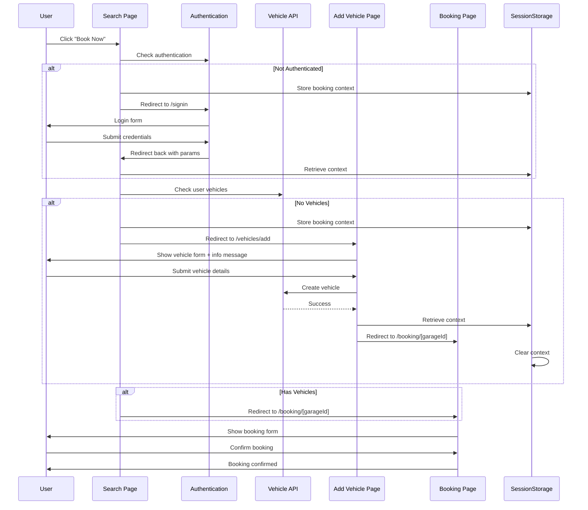

# Booking Flow

## Purpose & Scope

This document describes the complete booking flow for MOT appointments in the BookaMOT application. The flow handles authentication, vehicle verification, and booking creation with seamless context preservation across redirects.

---

## Implementation Guidelines

### Overview

The booking flow consists of three main stages:
1. **Authentication Check** - Ensure user is logged in
2. **Vehicle Verification** - Ensure user has registered vehicles
3. **Booking Creation** - Complete the MOT appointment booking

### Key Components

- **Search Page** (`src/app/search/page.tsx`) - Main entry point for booking
- **Vehicle Add Page** (`src/app/vehicles/add/page.tsx`) - Vehicle registration with booking context
- **Booking Page** (`src/app/booking/[garageId]/page.tsx`) - Final booking confirmation
- **Session Storage** - Preserves booking context across redirects

---

## User Flow Diagram



---

## Detailed Flow Steps

### Step 1: User Clicks "Book Now"

**Location:** Search Page (`/search`)

**Actions:**
1. User clicks "Book Now" button on a garage card
2. System stores booking context in session storage
3. System checks authentication status

**Booking Context Stored:**
```typescript
{
  location: string,        // Search location (postcode or coordinates)
  date: string,           // Selected date (YYYY-MM-DD)
  time: string | null,    // Selected time slot (HH:MM)
  selectedGarageId: string,
  selectedTimeSlot: string | null,
  timestamp: string
}
```

---

### Step 2: Authentication Check

**Condition:** `session.status === 'unauthenticated'`

**Actions:**
1. Store booking context in `sessionStorage`
2. Redirect to `/signin` with return URL
3. After login, redirect back to search page
4. Retrieve booking context from `sessionStorage`

**Code Reference:**
```typescript
// Store context
const storeBookingContext = (garageId: string, timeSlot?: string) => {
  const context = {
    location: searchLocation,
    date: selectedDate,
    time: timeSlot || null,
    selectedGarageId: garageId,
    selectedTimeSlot: timeSlot || null,
    timestamp: new Date().toISOString()
  }
  sessionStorage.setItem('bookingSearchContext', JSON.stringify(context))
}

// Redirect to signin
router.push(`/signin?callbackUrl=${encodeURIComponent(window.location.href)}`)
```

---

### Step 3: Vehicle Verification

**Condition:** User is authenticated

**Actions:**
1. Fetch user's vehicles from `/api/vehicles`
2. Check if user has any registered vehicles

**API Call:**
```typescript
const checkUserVehicles = async () => {
  const response = await fetch('/api/vehicles')
  const data = await response.json()
  return data.vehicles || []
}
```

**Decision:**
- **Has vehicles** → Proceed to Step 4
- **No vehicles** → Redirect to vehicle registration

---

### Step 4a: No Vehicles - Vehicle Registration

**Location:** Add Vehicle Page (`/vehicles/add`)

**Actions:**
1. Display vehicle registration form
2. Show informational message about booking in progress
3. User fills in vehicle details
4. After successful registration, retrieve booking context
5. Redirect to booking page with context parameters
6. Clear booking context from session storage

**Info Message:**
```
"Booking in progress: After adding your vehicle, you'll be redirected to complete your MOT booking."
```

**Redirect Logic:**
```typescript
const handleSubmit = async (e) => {
  // ... create vehicle ...
  
  // Check for booking context
  const contextStr = sessionStorage.getItem('bookingSearchContext')
  if (contextStr) {
    const context = JSON.parse(contextStr)
    
    // Build redirect URL
    const params = new URLSearchParams({
      location: context.location,
      date: context.date,
      ...(context.time && { time: context.time }),
      ...(context.selectedTimeSlot && { timeSlot: context.selectedTimeSlot })
    })
    
    // Clear context
    sessionStorage.removeItem('bookingSearchContext')
    
    // Redirect to booking
    router.push(`/booking/${context.selectedGarageId}?${params}`)
  } else {
    // Normal flow - redirect to dashboard
    router.push('/dashboard')
  }
}
```

---

### Step 4b: Has Vehicles - Direct Booking

**Location:** Booking Page (`/booking/[garageId]`)

**Actions:**
1. Display garage details
2. Show available time slots
3. List user's vehicles for selection
4. User selects vehicle and confirms booking
5. Create booking via `/api/bookings`

---

## Session Storage Schema

### Key
```
bookingSearchContext
```

### Data Structure
```typescript
interface BookingContext {
  location: string          // "SG2 9EN" or "London"
  date: string             // "2025-10-22"
  time: string | null      // "14:00" or null
  selectedGarageId: string // "clx123abc..."
  selectedTimeSlot: string | null // "14:00" or null
  timestamp: string        // ISO timestamp
}
```

### Lifecycle
- **Created:** When user clicks "Book Now"
- **Persists:** Across authentication and vehicle registration redirects
- **Cleared:** After successful vehicle registration redirect to booking page
- **NOT cleared:** On authentication redirect (intentional - allows return to booking)

---

## API Endpoints

### Check User Vehicles
```
GET /api/vehicles
```

**Response:**
```json
{
  "vehicles": [
    {
      "id": "clx123...",
      "registration": "AB12CDE",
      "make": "Ford",
      "model": "Focus",
      "year": 2020
    }
  ]
}
```

### Create Vehicle
```
POST /api/vehicles
```

**Request Body:**
```json
{
  "registration": "AB12CDE",
  "make": "Ford",
  "model": "Focus",
  "year": 2020,
  "fuelType": "PETROL"
}
```

### Create Booking
```
POST /api/bookings
```

**Request Body:**
```json
{
  "garageId": "clx123...",
  "vehicleId": "clx456...",
  "date": "2025-10-22",
  "timeSlot": "14:00"
}
```

---

## Error Handling

### Authentication Failure
- **Error:** User not authenticated
- **Action:** Redirect to `/signin` with callback URL
- **Recovery:** After login, return to search page with context

### No Vehicles
- **Error:** User has no registered vehicles
- **Action:** Redirect to `/vehicles/add` with booking context
- **Recovery:** After vehicle registration, continue to booking

### API Failure
- **Error:** Vehicle API returns error
- **Action:** Show error message, allow retry
- **Recovery:** User can try again or contact support

### Session Storage Unavailable
- **Error:** Browser doesn't support sessionStorage
- **Action:** Fall back to URL parameters
- **Recovery:** Context preserved in URL query string

---

## Testing Scenarios

### Scenario 1: Authenticated User with Vehicles
1. User is logged in
2. User has registered vehicles
3. Click "Book Now"
4. **Expected:** Direct redirect to booking page

### Scenario 2: Unauthenticated User
1. User is not logged in
2. Click "Book Now"
3. **Expected:** Redirect to signin
4. After login, return to search with context
5. Continue to booking

### Scenario 3: Authenticated User without Vehicles
1. User is logged in
2. User has no vehicles
3. Click "Book Now"
4. **Expected:** Redirect to vehicle registration
5. Show info message about booking
6. After vehicle registration, redirect to booking

### Scenario 4: Context Preservation
1. Start booking flow
2. Get redirected (auth or vehicle)
3. **Expected:** All search parameters preserved
4. Booking context maintained across redirects

---

## Notes

- All changes are backward compatible
- No database schema changes required
- Uses existing NextAuth authentication
- Uses existing vehicle and booking APIs
- Session storage is browser-based (no server state)
- Context automatically cleared after successful booking flow
- Supports both quick search and detailed search with date/time

---

## Related Documentation

- `onboarding-flow.md` - New user onboarding process
- `vehicle-registration-flow.md` - Vehicle registration details
- `garage-registration-flow.md` - Garage account setup

